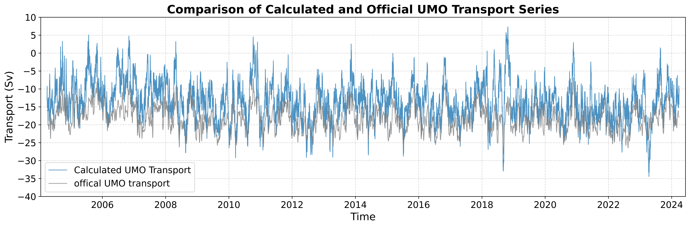

# Assignment2 Geostrophic transport and relating AMOC series -- report

- **Author** : Hengxi Yang
- **Date** : Sep 2026
- **Course** : 63-731 Data Analysis in Physical Oceanography

## 1. Introduction
### 1.1 Aim

- Compute the 26°N UMO geostrophic transport, compare it with the official UMO product, and compute the correlation coefficient between calcualted UMO transport and the official UMO transport timeseries.

- Calculate and illustrate the monthly climatology of both the 26°N MOC and UMO transport series. Plot the raw and deseasonalised figures for both timeseries.

- Perform an autocorrelation with T* marked, fit a linear trend for both the 26°N MOC and UMO transports series, and find the significance based on $N_eff$.

- Match 2 series, 26°N MOC and 47°N MOC to show a cross-correlation analysis for after removing their seasonal cycles. Draw scatter plots at the peak lag for both raw and deseasonalised data. Evaluate the significance.

- Perform a depth sensitivity analysis for the 26°N UMO transport to assess the effect of different max depths on the integrated transport values.

### 1.2 Dataset
1. `ts_gridded.nc`. Link: [rapid.ac.uk/data/gridded-mooring-data](https://rapid.ac.uk/data/gridded-mooring-data)

    - The gridded mooring data contains 5 vertical profiles, and all profiles comtain timeseries of 12-hourly temperature and salinity data gridded onto 20m intervals starting in Apr 2004.

2. `moc_transports.nc`. Link: [rapid.ac.uk/data/integrated-transports](https://rapid.ac.uk/data/integrated-transports)

    - 12-hourly, 10-days low pass filtered transport timeseries from Apr2004 to Mar 2024.

## 2. Results and Discussion
### Part1 Geostrophic Transport

 This figure shows the comparison between the calculated UMO transport timeseries and official product. The 2 series shows very similar fluctuations, and apprently, the calclated one always higher than the official product, with the calcualted data occasionally appearing more aggressive. 
Here is a table showing the results from the correlation analysis:

| Parameter | Value |
| :--- | :--- |
| **Valid Sample Points** | 14,599 |
| **Correlation ($r$)** | 0.762 ($p < 0.001$) |
| **Variance Explained ($R^2$)** | 58.1% |
| **Mean Bias** (Calculated − Official) | +4.911 Sv |
| **Root Mean Square Error (RMSE)** | 6.115 Sv |

According to the table, the calculated data is higher than official data by an average of 4.911 Sv, while the correlation between them reaches 76.2% with p value < 0.001, suggesting that they share almost the same dynamics.

I checked the function `interior_geostrophic_transport`, which sets a fixed max depth of 1100m, while RAPID uses a time-varing value. 

Besides, the function doesn't account for compensation transport, ignoring the mass-balance adjustment, while RAPID includes an external transport adjustment.

Overall, ignoring the compensation transport (which is always negative) is likely the main reason for the +4.911 Sv bias, and the fixed max depth of 1100m may explain the RMSE and aggressive fluctuations in the calculated UMO transport series.

Linear Regression fit:

$$
\begin{aligned} 
\text{Official UMO} &= 0.473 \times \text{Calculated UMO} - 11.998 \\ &\text{Slope Std Error} = 0.003 
\end{aligned}
$$

