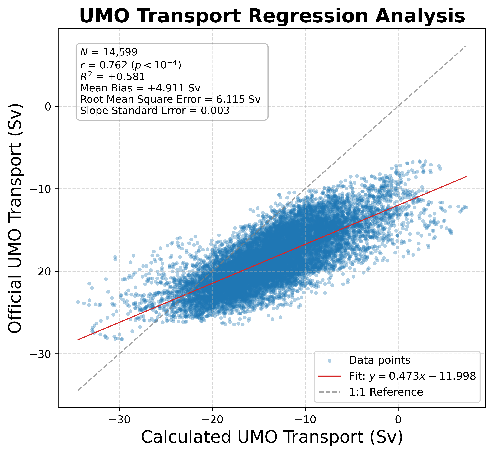
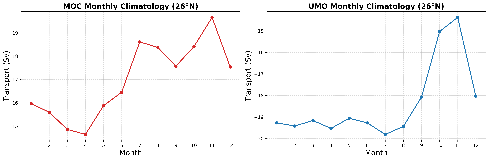
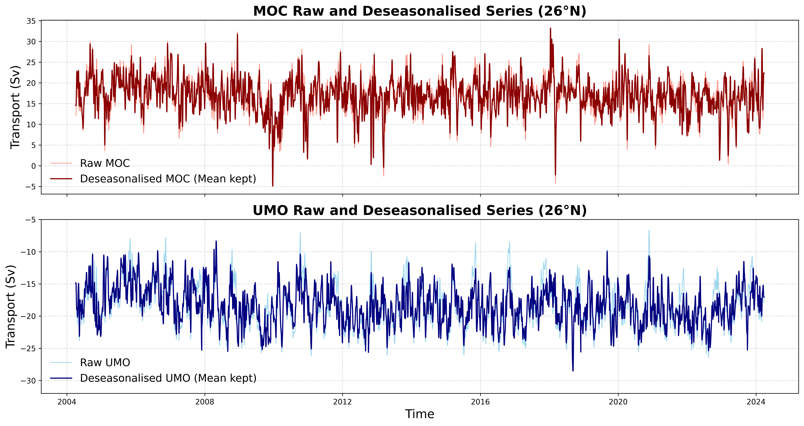
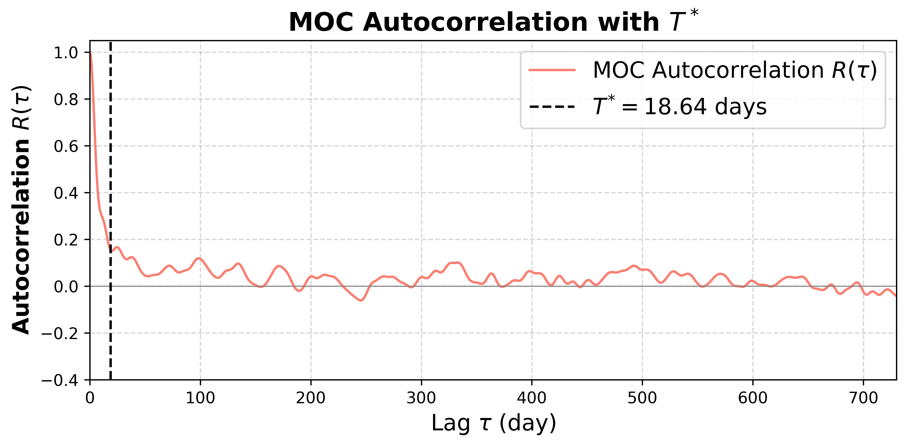
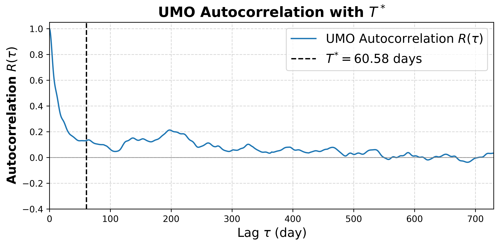
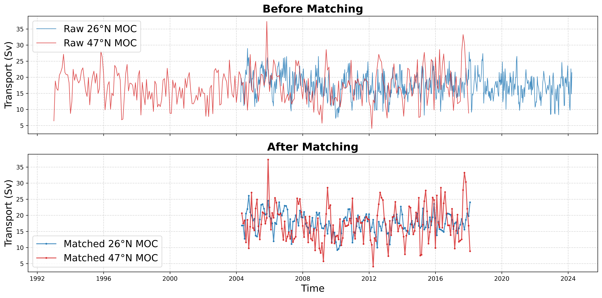
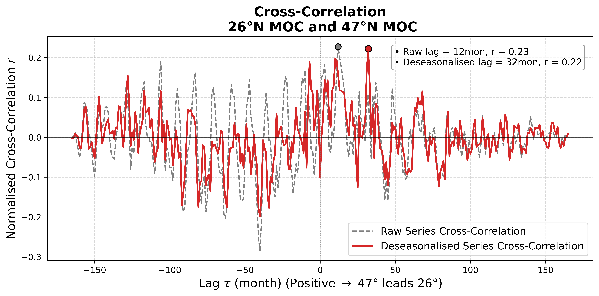

# Assignment 2 Report | Geostrophic transport and relating AMOC series

- **Author** : Hengxi Yang
- **Date** : Sep 2026
- **Course** : 63-731 Data Analysis in Physical Oceanography

## 1. Introduction
### 1.1 Aim

- Compute the 26°N UMO geostrophic transport, compare it with the official UMO product, and compute the correlation coefficient between calcualted UMO transport and the official UMO transport timeseries.

- Calculate and illustrate the monthly climatology of both the 26°N MOC and UMO transport series. Plot the raw and deseasonalised figures for both timeseries.

- Perform an autocorrelation with T* marked, fit a linear trend for both the 26°N MOC and UMO transports series, and find the significance based on $N_eff$.

- Match 2 series, 26°N MOC and 47°N MOC to show a cross-correlation analysis for after removing their seasonal cycles. Draw scatter plots at the peak lag for both raw and deseasonalised data. Evaluate the significance.

- Perform a depth sensitivity analysis for the 26°N UMO transport to assess the effect of different max depths on the integrated transport values.

### 1.2 Dataset
1. `ts_gridded.nc`. Link: [rapid.ac.uk/data/gridded-mooring-data](https://rapid.ac.uk/data/gridded-mooring-data)

    - The gridded mooring data contains 5 vertical profiles, and all profiles comtain timeseries of 12-hourly temperature and salinity data gridded onto 20m intervals starting in Apr 2004.

2. `moc_transports.nc`. Link: [rapid.ac.uk/data/integrated-transports](https://rapid.ac.uk/data/integrated-transports)

    - 12-hourly, 10-days low pass filtered transport timeseries from Apr 2004 to Mar 2024.

## 2. Results and Discussion
### Part 1 Geostrophic Transport

 

This figure shows the comparison between the calculated UMO transport timeseries and official product. The 2 series shows very similar fluctuations, and apprently, the calclated one always higher than the official product, with the calcualted data occasionally appearing more aggressive. 

Here is a table showing the results from the correlation analysis:

| Parameter | Value |
| :--- | :--- |
| **Valid Sample Points** | 14,599 |
| **Correlation ($r$)** | 0.762 ($p < 0.001$) |
| **Variance Explained ($R^2$)** | 58.1% |
| **Mean Bias** (Calculated − Official) | +4.911 Sv |
| **Root Mean Square Error (RMSE)** | 6.115 Sv |

According to the table, the calculated data is higher than official data by an average of 4.911 Sv, while the correlation between them reaches 76.2% with p value < 0.001, suggesting that they share almost the same dynamics.

I checked the function `interior_geostrophic_transport`, which sets a fixed max depth of 1100m, while RAPID uses a time-varing value. 

Besides, the function doesn't account for compensation transport, ignoring the mass-balance adjustment, while RAPID includes an external transport adjustment.

Overall, ignoring the compensation transport (which is always negative) is likely the main reason for the +4.911 Sv bias, and the fixed max depth of 1100m may explain the RMSE and aggressive fluctuations in the calculated UMO transport series.

Linear Regression fit:

$$
\begin{aligned} 
\text{Official UMO} &= 0.473 \times \text{Calculated UMO} - 11.998 \\ &\text{Slope Std Error} = 0.003 
\end{aligned}
$$

The second figure shows that the fit line shifts a lot from the 1:1 reference line. The slope of 0.47 indicates that the calculated data has roughly twice the amplitude of the official data. Besides, the intercept of -12 Sv matches the systematic bias discussed above.

### Part 2 Evaluating time series

#### 2A Seasonal cycle and trend (for both the 26°N MOC and UMO)

This climatology figures indicates that the MOC transport increases from April to June and decreases from Nov to March. Meanwhile, the UMO transport keeps stable from Jan to July, and decreases sharply starting from Aug.

MOC and UMO transports have significant seasonal cycles. To calculate correlation timescales T* and the effective sample size $N_{eff}$, deseasonalisation is necessary. 

After filtering out the seasonal effects, the residual anomalies will provide a more reliable estimation of T*. (The overall mean is remained, but the `autocorr` function uses `d  d-d.mean` to remove the mean when computing r and T*.)

The timeseries shows that the amplitude of the UMO series shrinks noticeably after deseasonalization.

The following figures shows the results of the autocorrelation for both the MOC and UMO timeseries.

| Variable | Integral Timescale ($T^*$) |
| :--- | :--- |
| **MOC** | 18.64 days |
| **UMO** | 60.58 days |

MOC has a much shorter T* relative to UMO according to the figures and the table above.

$$
\begin{aligned}
\text{UMO} = \text{Upper Geostrophic Transport}  + &\text{Compensation Transport} \\
\text{MOC} = \text{FC} + \text{Ek} & + \text{UMO}
\end{aligned}
$$

As the total sum of full-depth integrated transport, MOC manifests greater variability and high-frequency fluctuations. Therefore, its autocorrelation decays faster than that of UMO, which makes sense.

Here is a table showing the results from the linear regression trend analysis:

| Parameter | MOC | UMO |
| :--- | :--- | :--- |
| **Fitted Slope** | $-0.093\text{ Sv/yr}$ | $-0.109\text{ Sv/yr}$ |
| **Intercept** | $+17.903\text{ Sv}$ | $-17.274\text{ Sv}$ |
| **Naive Standard Error** | $0.006\text{ Sv/yr}$ | $0.004\text{ Sv/yr}$ |
| **Effective Standard Error** | $0.047\text{ Sv/yr}$ | $0.036\text{ Sv/yr}$ |
| **Effective Sample Size ($N_{\text{eff}}$)** | $223.933$ | $190.693$ |
| **Slope / Std. Error** | $-1.960$ | $-3.025$ |
| **P-value** | $5.12 \times 10^{-2}$| $2.83 \times 10^{-3}$ |
| **Significant (95%)** | **No** ($p > 0.05$) | **Yes** ($p < 0.05$) |

The average value of MOC decreases by 0.093 Sv for each year, while UMO decreases by 0.109 Sv annually. However, when we focus on the timeseries itself, it doesn't indicate a decreasing trend because strong noise masks it.

The project uses the `effective_dof` function to compute $N_{eff} ≈ 224$ for MOC and $N_{eff} ≈ 191$ for UMO. Compared with the original sample size $N = 14,599$, the effective sample size drops a lot due to autocorrelation.

Additionally, the p value of MOC exceeds 0.05, which means the trend lacks significance and it shouldn't be treated as a concrete conclusion.

#### 2B Cross-correlation of 26°N and 47°N MOC

26°N MOC and 47°N MOC have different timespans and sampling frequences,

|  Variable | Start Date | End Date | Total Data Points ($N$) |
| :--- | :--- | :--- | :--- |
| 26°N MOC | 2004-04-06 | 2024-03-22 | 730 |
| 47°N MOC | 1993-01-01 | 2018-01-01 | 301 |

therefore the two series need to be resampled on a common time grid before cross-correlation.

The following figure shows the cross-correlation results for the resampled 26°N and 47°N MOC timeseries. 

